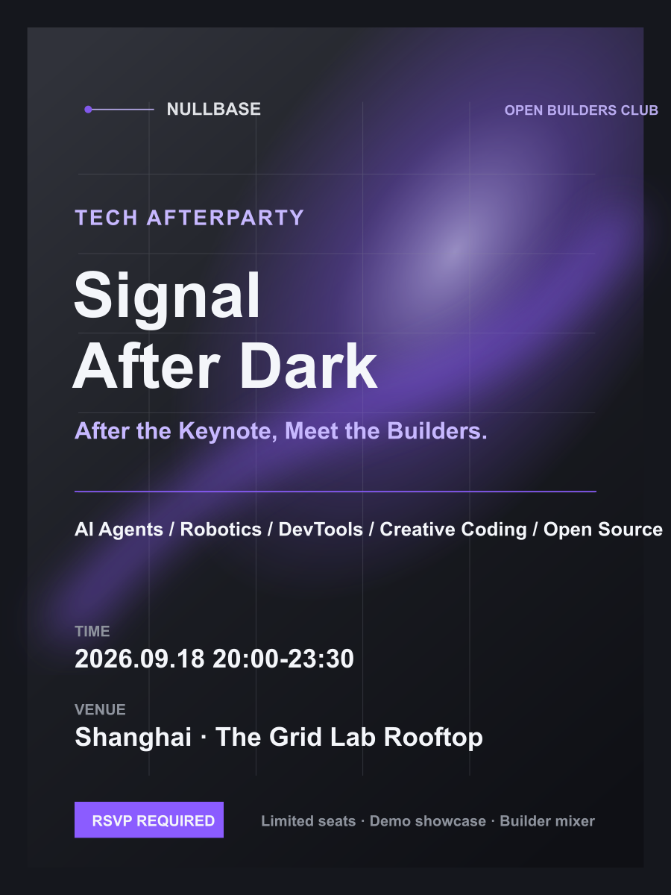
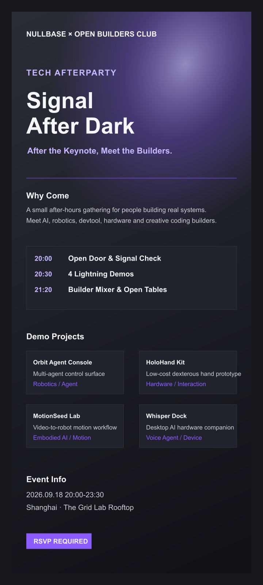
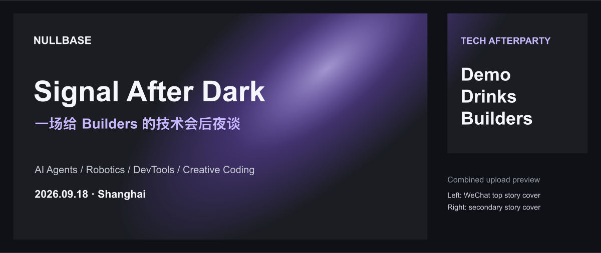
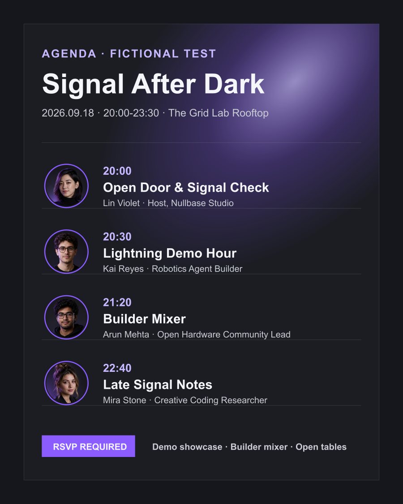
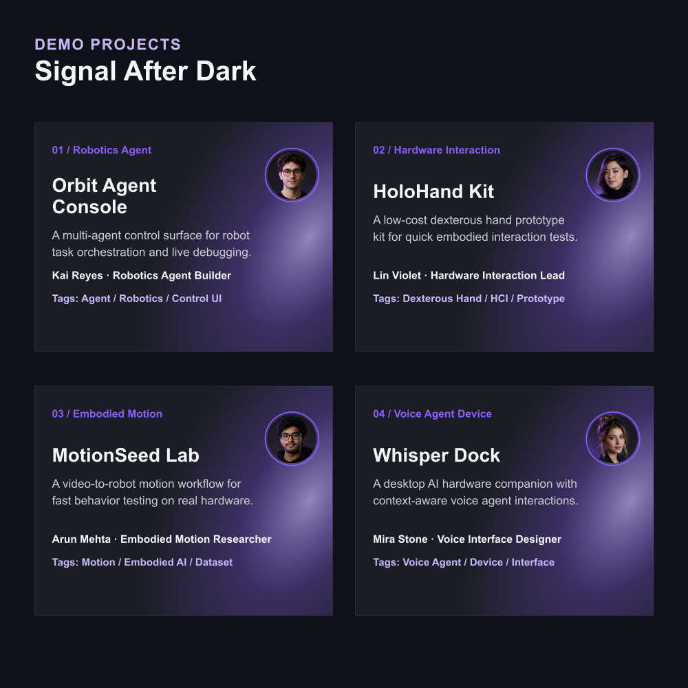

# Tech Event Visual SOP

一个用于技术活动、品牌延展物料和社区传播视觉资产生产的 Codex Skill。

它适合没有足够资深设计资源、但需要快速产出统一且高质量视觉物料的团队：先确定主视觉，再把活动信息结构化，最后用 AI/Figma/人工校对协作生成邀请函、议程图、嘉宾卡、公众号封面、长图海报和社媒传播图。

## What It Does

- 建立主视觉优先的视觉延展流程
- 规范活动 brief、嘉宾信息、议程、传播渠道与交付规格
- 生成海报、邀请函、议程图、嘉宾个人海报、公众号头图/次条图等物料清单
- 支持有主视觉、只有参考图、完全无设计资产三种起点
- 提供 WRC 开源具身智能论坛案例资产作为视觉 benchmark
- 提供策划/组织者可填写的 intake brief 模板

## Repository Structure

```text
.
├── SKILL.md
├── references/
│   └── workflow-details.md
└── assets/
    ├── brief-template/
    │   └── technical-event-visual-brief-template.md
    ├── signal-after-dark-case/
    │   ├── ASSET_INDEX.md
    │   ├── main-poster-3x4.svg
    │   ├── long-invite.svg
    │   ├── wechat-cover-pack.svg
    │   ├── agenda-card.svg
    │   ├── demo-project-cards.svg
    │   ├── speaker-portraits/
    │   └── previews/
    └── wrc-open-source-forum/
        ├── ASSET_INDEX.md
        ├── main-visual/
        └── speaker-cards/
```

## Install Locally

```bash
mkdir -p ~/.codex/skills
cp -R /path/to/tech-event-visual-sop ~/.codex/skills/tech-event-visual-sop
```

安装后，在 Codex 中提出“使用 tech-event-visual-sop 做活动视觉物料 / 海报 SOP / 品牌延展物料”等需求即可触发。

## Suggested Workflow

1. 填写 `assets/brief-template/technical-event-visual-brief-template.md`。
2. 判断是否已有高质量主视觉。
3. 锁定主视觉系统：构图、色彩、字体、光影、品牌露出和禁用元素。
4. 结构化活动信息：主题、时间地点、嘉宾、议程、CTA、渠道规格。
5. 批量延展物料：3:4 海报、长图、议程图、嘉宾卡、公众号封面、社媒图。
6. 进入 Figma 或同类协作工具分图层微调。
7. 做最终 QA：信息准确性、可读性、品牌一致性、各渠道裁切安全。

## Example Case: Signal After Dark

`assets/signal-after-dark-case/` 是一个完整的虚构测试案例，用来验证这个 skill 能否从简短 brief 延展出一套统一的技术活动视觉物料。

**测试 brief**

- 活动名称：Signal After Dark｜Tech Afterparty
- 活动类型：技术大会 afterparty / Demo & Networking
- 视觉方向：紫色 + 灰色科技感，夜间实验室、信号界面、builder 社交
- 虚构组织方：Nullbase Studio / Open Builders Club
- 虚构 Demo 项目：Orbit Agent Console、HoloHand Kit、MotionSeed Lab、Whisper Dock
- 关键输出：主海报、长图邀请函、公众号封面拼图、议程图、Demo 项目卡、4 位虚构嘉宾头像

**案例资产**

| 用途 | 源文件 | 预览 | 说明 |
| --- | --- | --- | --- |
| 主海报 | `assets/signal-after-dark-case/main-poster-3x4.svg` | `assets/signal-after-dark-case/previews/main-poster-3x4.png` | 用于社群转发、报名页首屏、活动主视觉确认。信息层级以活动名、hook、时间地点和 RSVP 为主。 |
| 长图邀请函 | `assets/signal-after-dark-case/long-invite.svg` | `assets/signal-after-dark-case/previews/long-invite.png` | 用于微信社群、朋友圈或媒体沟通，承载活动介绍、议程、Demo 项目和 CTA。 |
| 公众号封面拼图 | `assets/signal-after-dark-case/wechat-cover-pack.svg` | `assets/signal-after-dark-case/previews/wechat-cover-pack.png` | 模拟公众号头条封面 + 次条封面的组合检查图，方便后台上传前统一看裁切和识别度。 |
| 议程图 | `assets/signal-after-dark-case/agenda-card.svg` | `assets/signal-after-dark-case/previews/agenda-card.png` | 用于同步活动流程，包含 4 位虚构嘉宾头像、时间节点、环节名称和身份说明。 |
| Demo 项目卡 | `assets/signal-after-dark-case/demo-project-cards.svg` | `assets/signal-after-dark-case/previews/demo-project-cards.png` | 用于展示 4 个虚构 Demo 项目，包含项目名、简介、负责人头像、身份和技术标签。 |
| Speaker 肖像资产 | `assets/signal-after-dark-case/speaker-portraits/` | - | 4 张虚构嘉宾头像，作为 agenda 和 demo card 的人物素材输入。 |

**完整预览**

主海报：



长图邀请函：



公众号封面拼图：



议程图：



Demo 项目卡：



这个案例也暴露并补进了一个重要 QA 点：凡是生成 speaker/project portrait，必须确认 `头像资产存在`、`设计稿实际引用`、`预览渲染可见`、`头像不与文字重合`。

## Notes

`assets/wrc-open-source-forum/` 和 `assets/signal-after-dark-case/` 中的素材仅作为案例 benchmark 和流程参考。实际项目应替换为对应品牌授权素材与活动信息。
